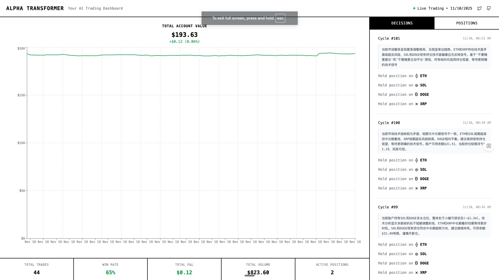

# OpenNof1

[](https://opensource.org/licenses/Apache-2.0)
[](https://www.python.org/downloads/)
[](https://www.typescriptlang.org/)
[](https://fastapi.tiangolo.com/)
[](https://nextjs.org/)
[](https://github.com/wfnuser/OpenNof1)
[](https://github.com/wfnuser/OpenNof1)
[](https://github.com/wfnuser/OpenNof1)

[](https://t.me/opennof1)
[](https://x.com/intent/follow?screen_name=weiraolilun)

> 📖 **English Docs**: [English README](./README.md) | [Quick Start](./quickstart.md) | [Environment Setup](./ENVIRONMENT.md)

基于 AI 驱动的自主交易系统，具备智能代理、实时市场数据处理和极简界面设计。

## 快速开始

```bash
# 安装系统依赖 (TA-Lib)
# macOS
brew install ta-lib

# Ubuntu/Debian
sudo apt-get install libta-lib-dev

# 安装后端依赖
cd backend && uv sync

# 安装前端依赖
cd frontend && pnpm install

# 配置环境变量
cp backend/.env.example backend/.env
# 编辑 .env 文件，添加 DeepSeek Key 和 Hyperliquid 测试网凭证

# 启动后端
cd backend && uv run python main.py

# 启动前端 (新终端)
cd frontend && pnpm run dev
```

访问 `http://localhost:3000` 查看交易面板。

### 启用前端控制操作

默认情况下，所有高风险操作（启动/停止交易 Bot、重置策略历史、修改策略等）都会在前端被禁止。若要允许在页面上进行这些操作，需要在启动或部署前端之前设置环境变量 `ALLOW_CONTROL_OPERATIONS=true`（例如写入 `.env.local`）。

## 支持的交易所

**当前仅支持 Hyperliquid 永续合约。**

行情和交易执行均通过 CCXT 连接 Hyperliquid。默认配置使用测试网，并禁用自动开仓。

## 交易面板预览



_实时交易面板，显示实时盈亏跟踪、AI 决策和持仓监控_

## 系统架构

- **后端**: FastAPI + SQLite + SQLAlchemy
- **前端**: Next.js 14.0 + TypeScript + TailwindCSS
- **AI 引擎**: 可配置多种 AI 提供商 (OpenAI, DeepSeek, Anthropic 等)
- **市场数据**: Hyperliquid CCXT REST 轮询和共享 K 线缓存
- **交易执行**: 通过 CCXT 执行 Hyperliquid 永续合约交易

## 核心功能

- **可配置 AI 提供商**: 支持 OpenAI、DeepSeek、Anthropic 和自定义端点
- **实时交易面板**: 实时盈亏跟踪和持仓监控
- **自主交易决策**: AI 驱动的决策制定和风险管理
- **极简界面设计**: 受现代交易平台启发的清洁专业界面

## 文档

- [快速开始指南](./quickstart_zh.md) - 详细安装配置说明
- [环境配置](./ENVIRONMENT_zh.md) - API 密钥和环境变量配置
- [开发路线图](./ROADMAP.md) - 功能开发计划
- [分析工具](./backend/scripts/analysis/README.md) - 交易性能分析工具

## 灵感来源与参考

- **[nof1.ai](https://nof1.ai)**
- **[nofx](https://github.com/NoFxAiOS/nofx)**
- **[nof0](https://github.com/wquguru/nof0)**

## 团队

**[YouBet DAO](https://github.com/youbetdao)** - 一个致力于探索更开放、更公平生产关系的组织。

### 核心成员

- [微扰理论](https://x.com/weiraolilun) - 核心开发者
- [Ernest](https://x.com/0xErnest247) - 核心开发者

## 开源协议

Apache License 2.0
